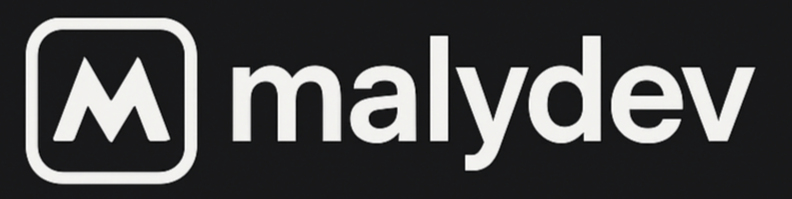

  

<h1 align="center">Hi there, I'm <strong>malydev</strong> 👋</h1>

  💡 Developer in progress · Passionate about building · Focused on growth

---

## 🚀 About

I'm a software developer in progress, currently learning and building my skills in mobile and web technologies.  
This account is part of my public dev identity — a space where I document what I build, explore tools I love, and share useful projects with the community.

- 🎓 Still learning — always
- 📱 I enjoy mobile dev and app design
- 💻 Linux user & clean code fan
- 🧪 Building in public

---

🛠️ Tech Stack (click to expand)

### 🧠 Languages

### ⚙️ Frameworks & Tools

### 📦 Package / Build

### 🗄️ Databases & Communication

---

## 📂 Featured Repositories

Coming soon:
- 📦 Open source tools
- 🛠️ Starter kits
- 🎓 Learning templates

While this grows, feel free to check out [my dev roots at `Mlipa`](https://github.com/Mlipa).

---

## 📫 Connect

- 🐦 Twitter/X: [@malydev](https://twitter.com/malydev) *(if active)*
- 🌐 Website: `coming soon...`

---

  <em>Building in public, one commit at a time.</em> 🚀

